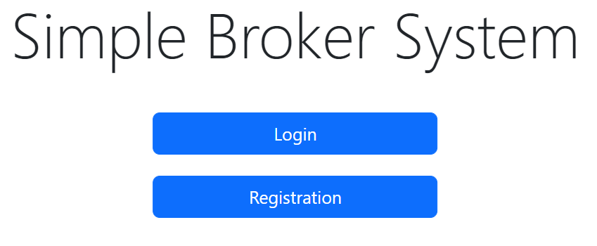

# Simple Broker System

Task description - [here](Task-Description.pdf)

Test coverage - 70%

Default credentials (login/password)

```
ADMIN CREDENTIALS
----------
admin
admin
----------
USER CREDENTIALS
----------
user1
user1
----------
user2
user2
```



To run application at localhost execute

```
gradlew bootRun --args='--spring.profiles.active=prod'
```

and go to `localhost:8080`